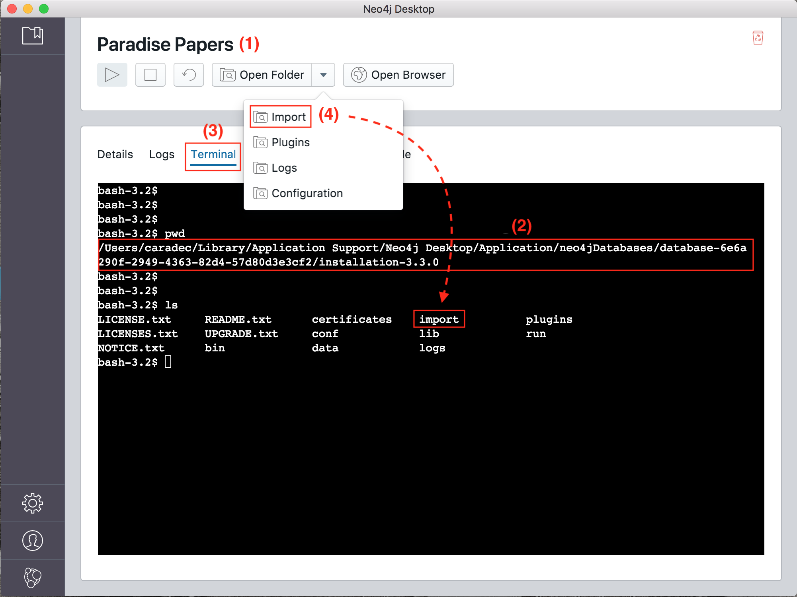

# Paradise Papers Neo4j Import

On December 1, [Neo4j](https://neo4j.com/) [released](https://neo4j.com/blog/icij-releases-neo4j-desktop-download-paradise-papers/) a version of its **Neo4j Desktop** tool containing [ICIJ Paradise Papers](https://www.icij.org/investigations/paradise-papers/) database.

This dataset, among others such as [Panama Papers](https://github.com/michelcaradec/Panama-Papers)' one, can also be downloaded on [ICIJ web site](https://offshoreleaks.icij.org/pages/database).

The following is a script to import Paradise Papers dataset into your existing Neo4j Desktop instance using [neo4j-admin](https://neo4j.com/docs/operations-manual/current/tools/neo4j-admin/) command line utility.

As it is **bash**, it only works on **Linux** and **MacOS**.

## Before Starting

All operations must be performed from Neo4j Desktop database (1) root directory (2), accessible via **Terminal** tab (3) in Neo4j Desktop. On MacOS, directory full path should be something like `/Users/$USER/Library/Application Support/Neo4j Desktop/Application/neo4jDatabases/database-$GUID/installation-$VERSION`.



## Data Retrieval

```bash
# Download
wget https://offshoreleaks-data.icij.org/offshoreleaks/csv/csv_paradise_papers.2017-11-17.zip
# Extract to import directory.
tar -xzvf csv_paradise_papers.2017-11-17.zip -C import
```

## Data Preparation

Few transformations must be done on original files to comply with Neo4j [CSV file header format](https://neo4j.com/docs/operations-manual/current/tools/import/file-header-format/).

### Nodes Files

#### Header Rows Engineering

1. `labels(n)` => `:LABEL`.
2. `n.node_id` => `node_id:ID`.
3. Remove double-quotes.
4. Remove "n." prefixes.

Sample script:

```bash
head -n 1 import/paradise_papers.nodes.address.csv |
    sed "s/labels(n)/\:LABEL/" |
    sed "s/n\.node_id/node_id\:ID/" |
    sed "s/\"//g" |
    sed "s/n\.//g"
```

Before:

```
"labels(n)","n.valid_until","n.country_codes","n.countries","n.node_id","n.sourceID","n.address","n.name","n.jurisdiction_description","n.service_provider","n.jurisdiction","n.closed_date","n.incorporation_date","n.ibcRUC","n.type","n.status","n.company_type","n.note"
```

After:

```
:LABEL,valid_until,country_codes,countries,node_id:ID,sourceID,address,name,jurisdiction_description,service_provider,jurisdiction,closed_date,incorporation_date,ibcRUC,type,status,company_type,note
```

#### Detail Rows Engineering

1. Remove `[""` pattern on label column.
2. Remove `""]` pattern on label column.

Sample script:

```bash
tail -n +2 import/paradise_papers.nodes.address.csv |
    sed "s/\[\"\"//" |
    sed "s/\"\"\]//"
```

Before (first two lines):

```
"[""Address""]","Appleby data is current through 2014","VGB","British Virgin Islands","81000002","Paradise Papers - Appleby","Palm Grove House","Palm Grove House; VG1110 Road Town; Tortola; British Virgin Islands","","","","","","","","","",""
"[""Address""]","Appleby data is current through 2014","MUS","Mauritius","81000005","Paradise Papers - Appleby","8th Floor, Medine Mews","8th Floor, Medine Mews; La Chaussee Street; Port Louis; Mauritius","","","","","","","","","",""
```

After:

```
"Address","Appleby data is current through 2014","VGB","British Virgin Islands","81000002","Paradise Papers - Appleby","Palm Grove House","Palm Grove House; VG1110 Road Town; Tortola; British Virgin Islands","","","","","","","","","",""
"Address","Appleby data is current through 2014","MUS","Mauritius","81000005","Paradise Papers - Appleby","8th Floor, Medine Mews","8th Floor, Medine Mews; La Chaussee Street; Port Louis; Mauritius","","","","","","","","","",""
```

### Relationships File

#### Header Rows Engineering

1. `node_1` => `:START_ID`.
2. `node_2` => `:END_ID`.
3. `rel_type` => `:TYPE`.
4. Remove double-quotes.
5. Remove "r." prefixes.

Sample script:

```bash
head -n 1 import/paradise_papers.edges.csv |
    sed "s/node_1/\:START_ID/" |
    sed "s/node_2/\:END_ID/" |
    sed "s/rel_type/\:TYPE/" |
    sed "s/\"//g" |
    sed "s/r\.//g"
```

Before:

```
"node_1","rel_type","node_2","r.sourceID","r.valid_until","r.start_date","r.end_date"
```

After:

```
:START_ID,:TYPE,:END_ID,sourceID,valid_until,start_date,end_date
```

### Data Preparation Full Script

Reminder: script must be executed from Neo4j Desktop database root directory, in **Terminal** tab.

```bash
# Nodes
for NODES_FILE in import/*.nodes.*.csv
do
    # Header Rows
    head -n 1 $NODES_FILE |
        sed "s/labels(n)/\:LABEL/" |
        sed "s/n\.node_id/node_id\:ID/" |
        sed "s/\"//g" |
        sed "s/n\.//g" > $NODES_FILE.refined
    # Detail Rows
    tail -n +2 $NODES_FILE |
        sed "s/\[\"\"//" |
        sed "s/\"\"\]//" >> $NODES_FILE.refined
done

# Relationships
for EDGES_FILE in import/*.edges.csv
do
    # Header Rows
    head -n 1 $EDGES_FILE |
        sed "s/node_1/\:START_ID/" |
        sed "s/node_2/\:END_ID/" |
        sed "s/rel_type/\:TYPE/" |
        sed "s/\"//g" |
        sed "s/r\.//g" > $EDGES_FILE.refined
    # Detail Rows
    tail -n +2 $EDGES_FILE >> $EDGES_FILE.refined
done
```

## Import

```bash
# Clean graph.db directory.
rm -d -r data/databases/graph.db
mkdir data/databases/graph.db
# Import
bin/neo4j-admin import \
    --nodes import/paradise_papers.nodes.address.csv.refined \
    --nodes import/paradise_papers.nodes.entity.csv.refined \
    --nodes import/paradise_papers.nodes.intermediary.csv.refined \
    --nodes import/paradise_papers.nodes.officer.csv.refined \
    --nodes import/paradise_papers.nodes.other.csv.refined \
    --relationships import/paradise_papers.edges.csv.refined \
    --quote "\""

# Clean import directory
rm import/*
```

The script for the entire process can be found in [import.sh](import.sh) file.

## Miscellaneous

Before importing data using **neo4j-admin**, an attempt was made to use [Cypher](https://neo4j.com/developer/cypher-query-language/) [LOAD CSV](http://neo4j.com/docs/developer-manual/current/cypher/clauses/load-csv/) command.

It worked fine for nodes import, but failed to import relationships, as their number was to important to be processed in an acceptable time (file `paradise_papers.edges.csv` contains **364 457** lines).

The script written for this attempt is available in [create.cypher](create.cypher) file.
